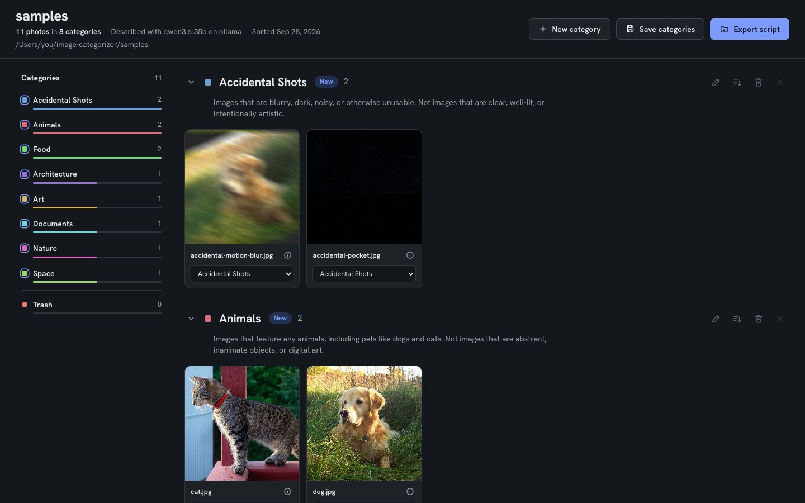
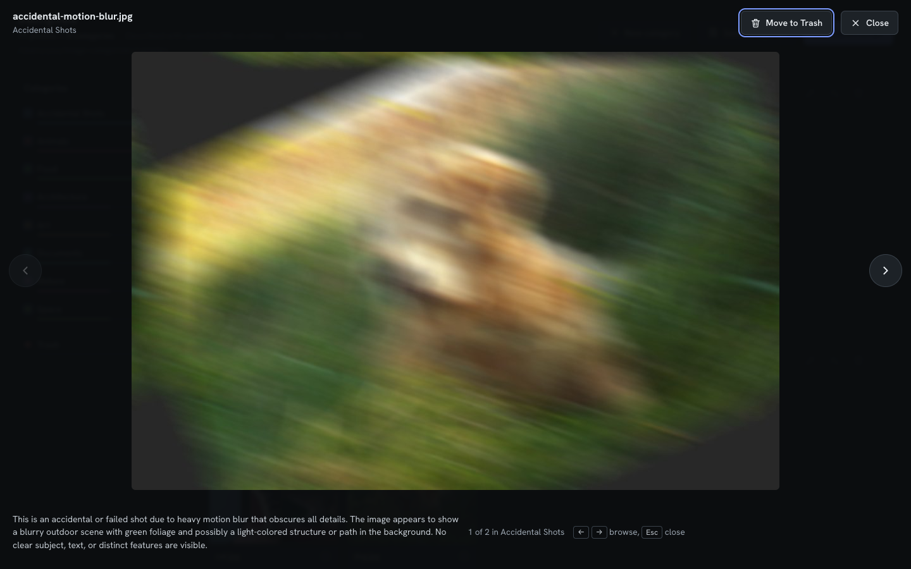
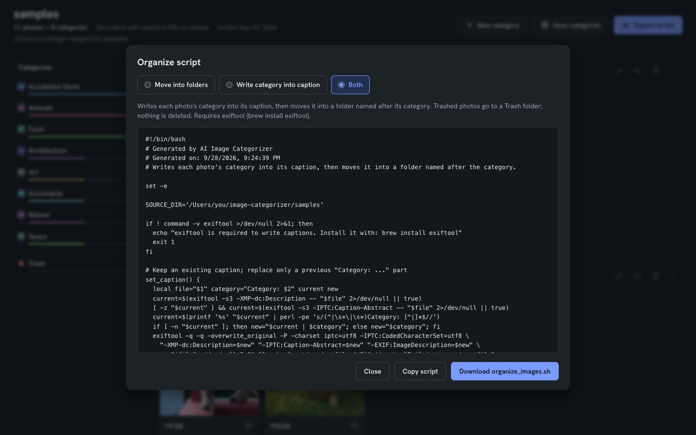
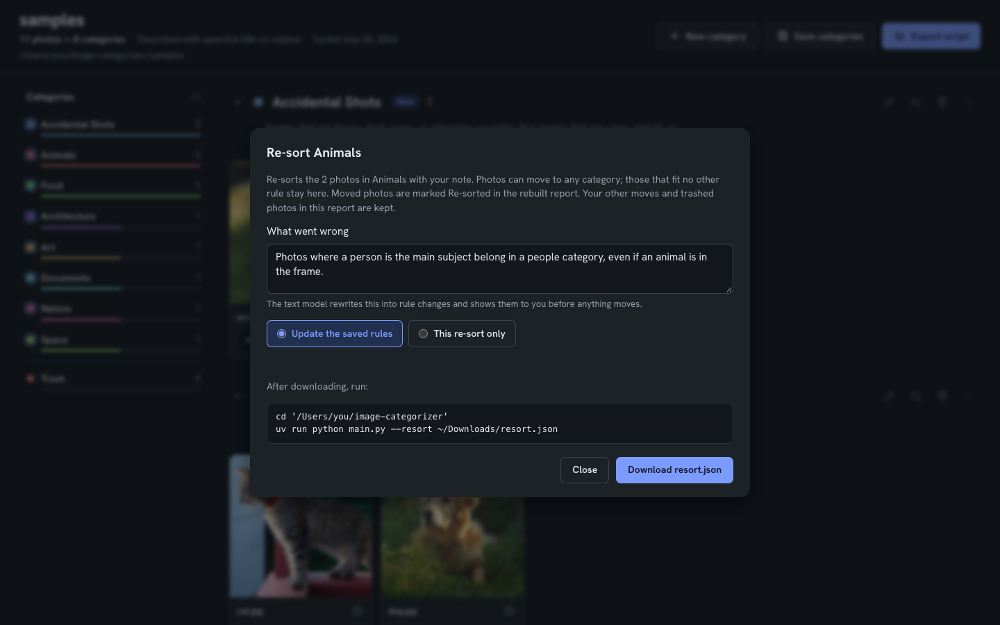

# Image Categorizer

Sorts a folder of photos into categories using local AI models served by
[Ollama](https://ollama.com). A vision model describes every photo and flags
accidental shots; a text model sorts the photos into categories you keep and
refine across runs. You review the result in a browser report and export a script
that moves the files into folders, writes each category into the photo's caption,
or both. No photo leaves your network.

Built for camera rolls full of accidental shots, near-duplicates and screenshots,
where reviewing every photo by hand is not practical.



[](https://www.python.org/downloads/)
[](https://ollama.com)
[](LICENSE)

## How it works

1. **Describe.** A vision model looks at each photo, writes a short description,
   and decides whether it is an accidental or failed shot (motion blur, pocket
   shot, no subject). With `--describe-only` (see below), descriptions are saved
   as they go and an interrupted run resumes where it stopped.
2. **Sort.** A text model assigns every photo to a category using the descriptions
   only, so re-sorting takes minutes and never looks at the images again. Each
   category has a rule describing what belongs in it, and the list is saved and
   reused for every library.
3. **Review.** A report in the browser lets you move photos between categories,
   trash them, and rename, merge or create categories.
4. **Apply.** The report exports a bash script: move each photo into a folder named
   after its category, write `Category: <name>` into its caption (searchable in the
   Photos app on Mac and iPhone), or both. Nothing is deleted.

The tool itself never moves, renames or deletes a photo.

## Quick start

**With an AI coding agent.** Open the repository in Claude Code (or a similar
agent) and ask it to follow [SETUP.md](SETUP.md). It checks the machine, installs
what is missing, configures Ollama and the models, and runs a smoke test on the
images in [`samples/`](samples/).

**By hand.** You need [uv](https://docs.astral.sh/uv/) and an Ollama server, on
this machine or another one on your network.

```bash
git clone https://github.com/DrBenedictPorkins/image-categorizer.git
cd image-categorizer
uv sync

ollama pull qwen3.6:35b            # vision model (describe)
ollama pull mistral-small3.2:24b   # text model (sort)
cp .env.example .env               # set OLLAMA_HOST if Ollama runs elsewhere

uv run python main.py samples --provider ollama
```

The last command sorts the eleven sample images and opens the report. Smaller
model pairs for 8-16 GB GPUs are listed in [SETUP.md](SETUP.md#5-ollama-and-models).

## Sorting a large library

Describe once, then sort as often as you like:

```bash
# Describe every photo (hours for thousands; rerun the same command to resume)
uv run python main.py "/path/to/photos" --description-provider ollama --describe-only

# Optional: build the category list and stop, to edit it before sorting
uv run python main.py "/path/to/photos" --categorization-provider ollama \
    --categorize-from "/path/to/photos/descriptions_only.json" --plan-categories --max-categories 12

# Sort and open the report (minutes)
uv run python main.py "/path/to/photos" --categorization-provider ollama \
    --categorize-from "/path/to/photos/descriptions_only.json" --max-categories 12
```

For reference: 1,195 photos took about 80 minutes to describe and 8 minutes to
sort with `qwen3.6:35b` and `mistral-small3.2:24b` on an RTX 4090.

## The report



- Photos grouped by category; the rail on the left shows counts and accepts drops
- Move a photo by dragging it or with its category menu, which also offers the
  model's suggested categories
- Rename, merge (rename to an existing name), create and remove categories; edit
  each category's rule
- Trash with restore; move a whole category to Trash in one step
- Full-size preview with the model's description; arrow keys browse the category
- **Save categories** downloads the category list, with your edits, for future runs
- **Export script** writes the organize script



Writing captions requires [exiftool](https://exiftool.org). An existing caption is
kept; a previous `Category:` part is replaced, so the script can be run again.

## Categories that carry over

Categories are saved in `~/.config/image-categorizer/categories.yaml` (override
with `CATEGORIES_FILE`) and reused for every library:

```yaml
categories:
  - name: Portraits
    rule: Photos of people looking at the camera, including selfies. Not group photos.
    status: kept
```

The first run builds the list from the photos. Later runs sort into the saved
list; only when enough photos fit none of the rules does the model propose a new
category, marked `new` in the report until you save the list. `--max-categories`
caps the list: once it is full, photos that fit nothing go to `Unsorted`.

## Re-sorting a category

When a category holds photos that belong elsewhere, click the re-sort button on
that category and describe what went wrong.



```bash
uv run python main.py --resort ~/Downloads/resort.json
```

The text model turns the note into rule changes and asks you to approve them,
shows how 10 sample photos would move, then re-sorts only that category. Photos
that fit no other category stay put. Moved photos are marked **Re-sorted** in the
rebuilt report, and edits made in the report before exporting are kept.

## Configuration

Settings live in `.env`; [`.env.example`](.env.example) lists them.

| Variable | Purpose |
|---|---|
| `OLLAMA_HOST` | Ollama server, default `http://localhost:11434` |
| `OLLAMA_MODEL` | Vision model for describing |
| `OLLAMA_TEXT_MODEL` | Text model for sorting and re-sorting |
| `CATEGORIES_FILE` | Saved category list |
| `MAX_CATEGORIES` | Category cap |

All command-line options: `uv run python main.py --help` and
[SETUP.md](SETUP.md#12-reference). Supported formats: `.jpg`, `.jpeg`, `.png`,
`.gif`, `.bmp`, `.webp`; HEIC and videos are skipped.

## Other providers

`--provider huggingface` runs BLIP-2, LLaVA or Flan-T5 in-process without Ollama
([docs/HUGGINGFACE_PROVIDER.md](docs/HUGGINGFACE_PROVIDER.md)), and
`--categorization-provider keyword` sorts by keyword matching. Both predate the
saved categories and re-sort features, and are less maintained.

## Project layout

| Path | Contents |
|---|---|
| `main.py` | Command line, workflows, re-sort |
| `providers/ollama_provider.py` | Describing, sorting, category proposals, rule rewrites |
| `core/categories.py` | Saved category list |
| `core/html_generator.py`, `template.html` | Report |
| `models/image_data.py` | Result data model |
| `SETUP.md` | Install and first run, written for AI coding agents |
| `samples/` | Public-domain sample images ([sources](samples/README.md)) |
| `docs/` | Provider guides, dependency audit, design notes, README images |
| `sundry/` | Archive of one-off scripts, not used by the app |

## License

MIT. See [LICENSE](LICENSE).
